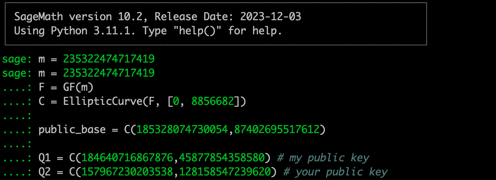
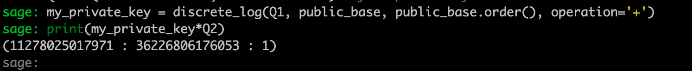

# Clever Thinking

## Introduction

> The purpose of this challenge is to find the `my_secret` and submit it as the flag.

The source code :
```python
m = 235322474717419
F = GF(m)
C = EllipticCurve(F, [0, 8856682])

public_base = (185328074730054:87402695517612:1)

Q1 = (184640716867876:45877854358580:1) # my public key
Q2 = (157967230203538:128158547239620:1) # your public key

secret = ...
my_private_key = ...
assert(my_private_key*public_base == Q1)
assert(my_private_key*Q2 == secret)
```

This is an elliptic curve challenge with all the variables known.

## Solution

> First let's get the `my_private_key`

Let's load sage


We can solve my_private_key using the discrete log function :
```python
my_private_key = discrete_log(Q1, public_base, public_base.order(), operation='+')
```

> Now let's get secret



and that's the flag !