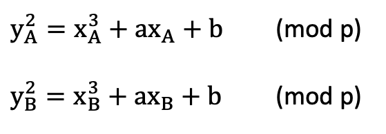

# Arranged

## Introduction

> Elliptic Curves !

An elliptic curve challenge that requires us to get the `p` and `b` parameters and they `C` that was used to as a key for AES encryption.

## Challenge

Code :
```python
from Crypto.Cipher import AES
from Crypto.Util.Padding import pad
from Crypto.Util.number import long_to_bytes
from hashlib import sha256

from secret import FLAG, p, b, priv_a, priv_b

F = GF(p)
E = EllipticCurve(F, [726, b])
G = E(926644437000604217447316655857202297402572559368538978912888106419470011487878351667380679323664062362524967242819810112524880301882054682462685841995367, 4856802955780604241403155772782614224057462426619061437325274365157616489963087648882578621484232159439344263863246191729458550632500259702851115715803253)

A = G * priv_a
B = G * priv_b

print(A)
print(B)

C = priv_a * B

assert C == priv_b * A

# now use it as shared secret
secret = C[0]

hash = sha256()
hash.update(long_to_bytes(secret))

key = hash.digest()[16:32]
iv = b'u\x8fo\x9aK\xc5\x17\xa7>[\x18\xa3\xc5\x11\x9en'
cipher = AES.new(key, AES.MODE_CBC, iv)

encrypted = cipher.encrypt(pad(FLAG, 16))
print(encrypted)
```

Now we notice that we don't have `b` and `p` parameters, so we need to get these 2 first.
We need to retrieve `p` first :

We know that an elliptic curve functions forms as the following :


Now we have point 'A' and point 'B' that can form the following 2 equations :



To eleminate 'b' from both the equations, we need to first get everything to one side for both equations, and then we substract the first equation from the second one :


We can do the same steps, but this time we involve G instead of A or B


Now we have in a short way :


Let's open up sage and do this :


> Note : A and B are not the ones in the code, I randomly named these 2 variables as A and B like the example before.

Since `B` was a negative number, all we need to do is to make it positive.

Now their GCD :
```python
sage: gcd(A, -B)
6811640204116707417092117962115673978365477767365408659433165386030330695774965849821512765233994033921595018695941912899856987893397852151975650548637533
```

Now we found our `p`, time for `b`.

We have point A, B, and G. Sorting them the correct way can equal to `b`. Thus we can apply CRT(Chinese Remainder Theorem) on them equations and we can find `b` :
```python
# b = y_b**2 - x_b**3 - 726*x_b (mod p)
sage: b = (y_b**2 - x_b**3 - 726*x_b) % p
sage: print(b)
42
```

Now we find `priv_a` using discrete_log function :
```python
sage: priv_a = discrete_log(A, G, G.order(), operation='+')
sage: print(priv_a)
4
```

Now let's get `C` and decrypt the flag :
```python
from Crypto.Util.number import *
from Crypto.Cipher import AES
from hashlib import sha256
secret = 926644437000604217447316655857202297402572559368538978912888106419470011487878351667380679323664062362524967242819810112524880301882054682462685841995367
hash = sha256()
hash.update(long_to_bytes(secret))
key = hash.digest()[16:32]
iv = b'u\x8fo\x9aK\xc5\x17\xa7>[\x18\xa3\xc5\x11\x9en'
cipher = AES.new(key, AES.MODE_CBC, iv)
enc_flag = b'V\x1b\xc6&\x04Z\xb0c\xec\x1a\tn\xd9\xa6(\xc1\xe1\xc5I\xf5\x1c\xd3\xa7\xdd\xa0\x84j\x9bob\x9d"\xd8\xf7\x98?^\x9dA{\xde\x08\x8f\x84i\xbf\x1f\xab'
decrypted = cipher.decrypt(enc_flag)
print(decrypted)
>> b'HTB{0rD3r_mUsT_b3_prEs3RveD_!!@!}\x0f\x0f\x0f\x0f\x0f\x0f\x0f\x0f\x0f\x0f\x0f\x0f\x0f\x0f\x0f'
```