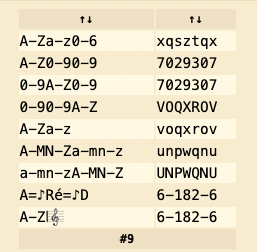

# Painoman

## Introduction

> A classic RSA encryption.

This is a simple RSA encryption code, but instead of getting just the `n` as usual, this time we have both prime numbers `p` and `q`, we need to find `e` only to be able to decrypt the cipher.

We got another image, with some musical note :
    <p align="center"></p>

So I'm guessing it's the `e` we looking for.

## A small reminder of how RSA works.

- RSA ENCRYPTION :
    1. Generate `p` and `q` prime numbers.
    2. Calculate `n` which is `n=p*q`
    3. Calculate `phi` which is `phi=(p-1)*(q-1)`
    4. Find `e` where `1 < e < phi` and `e` and `phi` must be coprime
    5. For decryption, need to calculate private key `d`, which is the multiplicative inverse of e (mod phi) `pow(e, -1, phi)`
    6. For encryption : `c = pow(m, e, n)`
    7. For decryption : `m = pow(c, d, n)`

## Solution

> Decrypt the musical note, using : https://www.dcode.fr/music-sheet-cipher

<p align="center"></p>

If we check if `7029307` is coprime with our calculated `phi`, we'll find them coprime.

Decryption code :
```python
from Crypto.Util.number import long_to_bytes

p = 151974537061323957822386073908385085419559026351164685426097479266890291010147521691623222013307654711435195917538910433499461592808140930995554881397135856676650008657702221890681556382541341154333619026995004346614954741516470916984007797447848200982844325683748644670322174197570545222141895743221967042369
q = 174984645401233071825665708002522121612485226530706132712010887487642973021704769474826989160974464933559818767568944237124745165979610355867977190192654030573049063822083356316183080709550520634370714336131664619311165756257899116089875225537979520325826655873483634761961805768588413832262117172840398661229
n = p * q
m = 13798492512038760070176175279601263544116956273815547670915057561532348462120753731852024424193899030774938204962799194756105401464136384387458651343975594539877218889319074841918281784494580079814736461158750759327630935335333130007375268812456855987866715978531148043248418247223808114476698088473278808360178546541128684643502788861786419871174570376835894025839847919827231356213726961581598139013383568524808876923469958771740011288404737208217659897319372970291073214528581692244433371304465252501970552162445326313782129351056851978201181794212716520630569898498364053054452320641433167009005762663177324539460

e = 7029307


phi = (p-1)*(q-1)
d = pow(e, -1, phi)

c = pow(m, d, n)
print(long_to_bytes(c))
```

We run this :
```bash
[mza7a@Wano Pianoman ]$ python3 solver.py
b'uoftctf{AT1d2jMCVs03xxalViU9zTyiiV1INNJY}'
```
