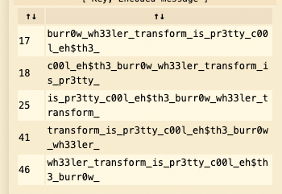

# Wheel Barrow

## Introduction

> This is a normal cipher. The hint is in the name of the challenge. There's an encryption called `Burrows-Wheeler Transform`.

Visit the following link : https://www.dcode.fr/burrows-wheeler-transform

Just need to input the text, since we do not know the key, we bruteforce it.

<p align="center"></p>

There's a `th3_` at the end, we put it in the beginning and we wrapt that in the flag format :
```
uoftctf{th3_burr0w_wh33ler_transform_is_pr3tty_c00l_eh$}
```